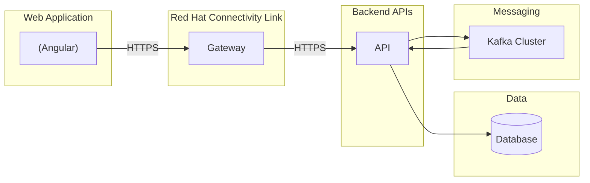

# Architecture

## Communication Flow

## Core Services

| Service               | Product                   | Purpose                           |
| ---                   | ---                       | ---                               |
| dns.exarep.com        | Cloudflare DNS            | Domain Name Resolution            |
| ntp.exarep.com        | Cloudflare NTP            | Network Time Protocol             |
| docs.exarep.com       | GitHub Pages              | Project documentation             |
| auth.exarep.com       | Red Hat build of Keycloak | Authentication and Authorization  |
| secrets.exarep.com    | Hashicorp Vault           | Secrets management and KPI        |

* [Red Hat build of Keycloak](https://docs.redhat.com/en/documentation/red_hat_build_of_keycloak/latest)  
* [Hashicorp Vault](https://developer.hashicorp.com/vault)  
* [GitHub Pages](https://pages.github.com/)  

## Clusters

Clusters will be managed through two projects: `iac` and `gitops-platform`.

| Cluster                    | Type     | Purpose                       |
| ---                        | ---      | ---                           |
| hub.cluster.exarep.com     | hub      | Full development platform     |
| dev.cluster.exarep.com     | spoke    | Development workloads         |
| test.cluster.exarep.com    | spoke    | Testing workloads             |
| prod.cluster.exarep.com    | spoke    | Production workloads          |

## User Experience

Web projects are built using Angular and ng-bootstrap. They are served using Red Hat JBoss Web Server running in OpenShift. 

| Project           | Production URL                    | Purpose                                               |
| ---               | ---                               | ---                                                   |
| web-public        | https://exarep.com                | Public marketing site and new customer enrollments    |
| web-customer      | https://customer.exarep.com       | Customer portal for managing contracts and billing    |
| web-administrator | https://administrator.exarep.com  | Administration portal for Exarep employees            |

## API Gateways

| Gateway                               | Type      | Purpose                                   |
| ---                                   | ---       | ---                                       |
| public.apigateway.exarep.com          | public    | API gateway for public endpoints          |
| customer.apigateway.exarep.com        | protected | API gateway for customer endpoints        |
| administrator.apigateway.exarep.com   | protected | API gateway for administrator endpoints   |

