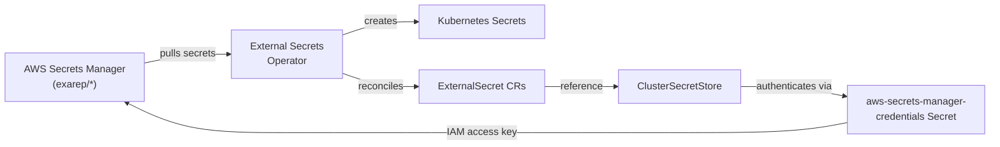

# GitOps Platform

The `gitops-platform` project manages the platform operator lifecycle on OpenShift using the Argo CD app-of-apps pattern. It bootstraps the External Secrets Operator, OpenShift GitOps, and the Argo CD instances that drive all platform configuration.

## Prerequisites

- Python 3
- `oc` CLI authenticated to the target cluster
- AWS Secrets Manager secrets provisioned by the [`iac`](iac.md) project
- The `exarep/aws-credentials` and `exarep/test` secrets populated in AWS Secrets Manager

## Getting started

Clone the repository and set up the environment:

```shell
git clone https://github.com/exarep/gitops-platform.git
cd gitops-platform
python3 -m venv .venv
source .venv/bin/activate
pip install -r requirements.txt
ansible-galaxy collection install -r requirements.yaml
```

## Bootstrap

Log in to the target cluster and run the bootstrap playbook:

```shell
oc login --server=https://api.hub.cluster.exarep.com:6443
ansible-playbook bootstrap.yaml
```

### What the bootstrap does

The [`bootstrap.yaml`](https://github.com/exarep/gitops-platform/blob/main/bootstrap.yaml){:target="_blank"} playbook provisions the cluster in stages:

#### External Secrets Operator

1. Installs the External Secrets Operator via OLM (namespace, operator group, subscription)
2. Waits for the operator CSV to reach `Succeeded`
3. Applies the `ExternalSecretsConfig` custom resource
4. Waits for the external-secrets webhook deployment to be ready
5. Creates the `aws-secrets-manager-credentials` Kubernetes secret from local AWS credentials
6. Applies a `ClusterSecretStore` that connects to AWS Secrets Manager using those credentials
7. Applies a test `ExternalSecret` that pulls `exarep/test` from AWS Secrets Manager
8. Verifies the test secret is created and the `ExternalSecret` status is `SecretSynced`

#### OpenShift GitOps *(planned)*

1. Installs the OpenShift GitOps Operator via OLM
2. Creates the `gitops-platform` Argo CD instance for platform resources
3. Creates the `gitops-workloads` Argo CD instance for application workloads
4. Applies the app-of-apps to begin managing all platform resources via GitOps

## Project structure

```
gitops-platform/
├── ansible.cfg
├── bootstrap.yaml
├── requirements.txt
├── requirements.yaml
├── clusters/
│   └── hub/
└── resources/
    ├── external-secrets-operator/
    │   ├── namespace.yaml
    │   ├── operator-group.yaml
    │   ├── subscription.yaml
    │   ├── external-secrets-config.yaml
    │   ├── cluster-secret-store.yaml
    │   └── test-external-secret.yaml
    ├── openshift-gitops-operator/
    │   ├── namespace.yaml
    │   ├── operator-group.yaml
    │   └── subscription.yaml
    ├── gitops-platform/
    │   ├── namespace.yaml
    │   └── argocd.yaml
    └── gitops-workloads/
        ├── namespace.yaml
        └── argocd.yaml
```

## Secrets integration

The External Secrets Operator bridges AWS Secrets Manager with the OpenShift cluster:



| Component                           | Purpose                                                   |
| ---                                 | ---                                                       |
| `ClusterSecretStore`                | Cluster-wide store pointing to AWS Secrets Manager        |
| `aws-secrets-manager-credentials`   | Kubernetes secret with AWS IAM credentials for the store  |
| `ExternalSecret`                    | Declares which AWS secret to sync into which K8s secret   |

## Execution order

The `gitops-platform` bootstrap runs after the `iac` project has provisioned the infrastructure:

```shell
# 1. Provision infrastructure (iac project)
cd iac
ansible-playbook playbooks/pb-setup-dns.yaml
ansible-playbook playbooks/pb-setup-secrets.yaml
ansible-playbook playbooks/pb-create-hub-cluster.yaml

# 2. Populate the AWS credentials secret
aws secretsmanager put-secret-value \
  --secret-id exarep/aws-credentials \
  --secret-string '{"aws_access_key_id": "<key>", "aws_secret_access_key": "<secret>"}'

# 3. Bootstrap the platform (gitops-platform project)
cd ../gitops-platform
oc login --server=https://api.hub.cluster.exarep.com:6443
ansible-playbook bootstrap.yaml
```
